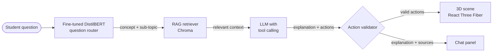

<div align="center">
# VistaraX
 
### AI-Powered Interactive 3D Visualization Platform
 
**See it. Ask it. Understand it.**
 
An AI tutor that explains hard concepts in interactive 3D — from satellite orbits and the human heart to support vector machines and quantum physics.
 
[](#roadmap)
[](https://react.dev)
[](https://docs.pmnd.rs/react-three-fiber)
[](https://fastapi.tiangolo.com)
[](https://huggingface.co/docs/transformers)
[](#license)
 
**Live demo:** coming soon · **Demo video:** coming soon
 
<!-- Replace the two "coming soon" entries with real links once deployed. -->
 
</div>
---
 
<!-- Add a short GIF of the tutor controlling a scene (after the Week 4 checkpoint). -->
<p align="center">
  
</p>
## Table of Contents
 
- [The Problem](#the-problem)
- [The Solution](#the-solution)
- [Features](#features)
- [The 5 Concepts in v1](#the-5-concepts-in-v1)
- [How It Works](#how-it-works)
- [AI Components](#ai-components)
- [Design Decisions](#design-decisions)
- [Tech Stack](#tech-stack)
- [Project Structure](#project-structure)
- [Getting Started](#getting-started)
- [API Reference](#api-reference)
- [Evaluation](#evaluation)
- [Roadmap](#roadmap)
- [Credits](#credits)
- [License](#license)
- [Author](#author)
---
 
## The Problem
 
Students are asked to understand things they have never actually *seen*: how a satellite stays in orbit, why an electron behaves like a wave, how blood moves through the four chambers of the heart, what a "kernel trick" does to data. Textbooks explain these with static diagrams and paragraphs, so students end up memorising instead of understanding.
 
## The Solution
 
**VistaraX** lets a student explore a concept in interactive 3D and ask questions in plain language. An AI tutor answers **and drives the 3D scene while it explains** — rotating the camera, highlighting parts, running animations and changing parameters — so the explanation and the visual always match.
 
Answers are grounded in trusted content (NCERT textbooks and curated notes), and the app runs in the browser, including on low-end phones.
 
---
 
## Features
 
- **Interactive 3D scenes** — rotate, zoom, drag objects and change parameters in real time
- **AI tutor that controls the scene** — the LLM uses tool calling to focus, highlight, animate and adjust each scene as it explains
- **Grounded answers with sources** — retrieval-augmented generation over NCERT content and curated notes, with sources shown for every answer
- **Fine-tuned transformer router** — a DistilBERT model trained on student-style questions routes each question to the right concept and sub-topic
- **Safe by design** — every AI action is validated against the active scene before it runs
- **Lightweight** — compressed models and procedural scenes built for mobile browsers
---
 
## The 5 Concepts in v1
 
| # | Concept | Subject | Level | Signature interaction |
|---|---|---|---|---|
| 1 | Solar System & Satellites | Physics · Space | Class 9–11 | Change a satellite's speed: it falls, orbits or escapes |
| 2 | Support Vector Machines | Maths · ML | College | Watch the kernel trick lift data into 3D |
| 3 | Double-Slit Experiment | Quantum Physics | Class 12 · College | Turn on a detector and the interference pattern vanishes |
| 4 | Atomic Orbitals & Bonding | Chemistry | Class 11–12 | Push two atoms together and watch orbitals merge into a bond |
| 5 | Heart & Blood Flow | Biology | Class 10–11 | Follow one drop of blood through the full circuit |
 
### 1. Solar System & Satellites
 
Explore planetary orbits, then zoom into Earth to compare geostationary and polar satellites and discover why a satellite doesn't fall.
 
- **See:** the Sun and planets in orbit; Earth with satellites in different orbits
- **Do:** speed up or slow down time; change a satellite's speed and watch it fall, orbit or escape
- **Ask:** *"Why doesn't the satellite fall down?"* → the tutor slows time, shows the velocity and gravity vectors, and explains orbital speed
- **AI actions:** `focus` · `set_time_speed` · `set_satellite_speed` · `show_orbit` · `show_vectors` · `label`
### 2. Support Vector Machines
 
See how an SVM finds the widest possible gap between two classes — and how the kernel trick separates data that no straight line can.
 
- **See:** two classes of points, the maximum-margin boundary, the margin, and the support vectors highlighted
- **Do:** drag points and watch the boundary update live; switch between linear and RBF kernels; tune `C`
- **Ask:** *"What does the kernel trick actually do?"* → the tutor lifts the points into 3D (z = x² + y²), shows the flat plane that separates them, then projects back down to reveal the curved boundary
- **AI actions:** `highlight_support_vectors` · `show_margin` · `apply_kernel` · `lift_to_3d` · `set_param`
### 3. Double-Slit Experiment
 
Fire particles one at a time through two slits and watch an interference pattern build up dot by dot — then observe the particles and watch it disappear.
 
- **See:** a particle source, two slits, and a screen recording each hit
- **Do:** change fire rate, slit gap and wavelength; switch between one and two slits; toggle the detector
- **Ask:** *"Why does the pattern disappear when we watch?"* → the tutor turns on the detector, resets the screen, fires new particles and explains wave–particle duality and measurement
- **AI actions:** `fire_particles` · `set_slit_gap` · `set_wavelength` · `toggle_detector` · `reset_screen`
### 4. Atomic Orbitals & Bonding
 
See electrons as 3D probability clouds and watch those clouds overlap to form chemical bonds — connecting quantum physics to chemistry.
 
- **See:** s, p and d orbitals; two atoms bonding; H₂, H₂O and CH₄ with their shapes and bond angles
- **Do:** pick an orbital type; drag two atoms together; switch between molecules
- **Ask:** *"Why is a water molecule bent and not straight?"* → the tutor shows H₂O, displays the bond angle, highlights the lone pairs and explains how they push the bonds together
- **AI actions:** `show_orbital` · `bring_atoms_together` · `show_molecule` · `show_bond_angle` · `show_lone_pairs`
### 5. Heart & Blood Flow
 
Look inside a beating heart: four chambers, the valves, and oxygen-rich and oxygen-poor blood moving through the lungs and body.
 
- **See:** chambers, valves, and blood flow in red (oxygenated) and blue (deoxygenated)
- **Do:** click any chamber; play or pause the heartbeat; open a cutaway view; follow a single drop of blood
- **Ask:** *"Why does blood go to the lungs before the body?"* → the tutor traces the path from the right ventricle to the lungs and back, highlighting each chamber as it explains
- **AI actions:** `highlight` · `focus` · `play_animation` · `trace_blood_path` · `cutaway`
---
 
## How It Works
 

 
**Request lifecycle — example:** a student in the heart scene asks *"What stops blood flowing backwards?"*
 
1. **Route** — the fine-tuned DistilBERT router classifies the question as `heart/valves`.
2. **Retrieve** — the retriever fetches the most relevant chunks about heart valves, filtered to the `heart` concept.
3. **Reason** — the LLM receives the question, the retrieved context and only the heart scene's actions as tools. It writes an explanation and calls `focus("tricuspid_valve")`, `highlight("tricuspid_valve")` and `play_animation("valve_close")`.
4. **Validate** — the backend checks every action against the heart scene's registry and argument schemas, and drops anything invalid.
5. **Render** — the frontend runs the actions in sequence while the explanation and its sources appear in the chat panel.
---
 
## AI Components
 
### Question router — fine-tuned transformer
 
| | |
|---|---|
| **Model** | DistilBERT, fine-tuned for sequence classification |
| **Labels** | 15 sub-topics (3 per concept) plus `out_of_scope` |
| **Data** | Hand-written student-style questions — casual, formal and slightly wrong phrasings — split 70/15/15 |
| **Training** | Hugging Face `transformers` + `datasets` on Google Colab |
| **Compared against** | TF-IDF + logistic regression baseline, and zero-shot LLM classification |
 
Labels: `solar_system/{planets, satellite_orbits, orbital_speed}` · `svm/{margin, support_vectors, kernel_trick}` · `quantum/{interference, wave_particle, observation}` · `chemistry/{orbitals, bonding, molecular_shape}` · `heart/{chambers, valves, circulation}` · `out_of_scope`
 
The `out_of_scope` class lets the tutor say honestly when a question isn't covered yet, instead of guessing.
 
### Retrieval-augmented generation (RAG)
 
- **Content:** NCERT excerpts (gravitation, atoms and bonding, the heart) and curated notes for SVMs and quantum physics
- **Pipeline:** chunk (300–500 tokens with overlap) → embed with `sentence-transformers/all-MiniLM-L6-v2` → store in Chroma → retrieve top-k chunks filtered by the routed concept
- **Output:** every answer returns the sources it used, shown in the UI
### LLM tutor with tool calling
 
- Each scene exposes a small registry of actions, defined as tools with typed arguments
- The LLM sees only the tools for the active scene, which keeps it focused and reduces invalid calls
- The backend validates names and arguments with Pydantic before anything reaches the frontend
- The LLM provider is configurable (Claude or OpenAI)
### Tiny GPT from scratch (learning track)
 
`tiny-gpt/` contains a character-level GPT built from scratch, following Andrej Karpathy's *Let's build GPT*: tokenization, embeddings, self-attention, transformer blocks and text generation. It isn't part of the product; it documents my understanding of how the models used here work inside.
 
---
 
## Design Decisions
 
- **Curated 3D, AI-controlled — not AI-generated 3D.** AI-generated 3D is slow and often scientifically wrong. Here the AI only manipulates hand-built scenes through a fixed action API, so what students see is always accurate.
- **A small fine-tuned router before the LLM.** Routing with DistilBERT is fast, cheap and measurable. It also narrows both retrieval and the tools the LLM sees, which reduces wrong answers and wrong actions.
- **Every action is validated.** The LLM cannot call a function that doesn't exist in the scene or set impossible values (e.g. a negative wavelength).
- **Answers show their sources.** Students and teachers can check where an explanation came from.
- **Built for low-end phones.** Three of the five scenes (orbits, SVM, double-slit) are generated procedurally in code with no downloaded models; the rest use low-poly glTF models with Draco compression.
---
 
## Tech Stack
 
| Layer | Technology |
|---|---|
| Frontend | React 18, Vite, React Three Fiber, drei, Tailwind CSS, Zustand |
| 3D assets | glTF + Draco compression, NASA textures, PubChem molecule data |
| Backend | Python 3.11, FastAPI, Pydantic |
| LLM | Claude or OpenAI API (tool calling) |
| Retrieval | sentence-transformers, Chroma |
| Fine-tuning | Hugging Face `transformers` and `datasets`, PyTorch, Google Colab |
| Classical ML | scikit-learn (SVM scene, router baseline) |
| Deployment | Vercel (frontend), Render or Hugging Face Spaces (backend) |
 
---
 
## Project Structure
 
```
vistarax/
├── frontend/
│   ├── src/
│   │   ├── scenes/            # SolarSystem, SVM, DoubleSlit, Orbitals, Heart
│   │   ├── actions/           # maps validated action JSON → scene functions
│   │   ├── components/        # chat panel, controls, layout
│   │   └── store/             # scene and chat state
│   └── public/models/         # compressed glTF assets
├── backend/
│   ├── app/
│   │   ├── main.py            # FastAPI app and routes
│   │   ├── router.py          # loads the fine-tuned DistilBERT router
│   │   ├── rag.py             # retrieval
│   │   ├── llm.py             # LLM calls with tool calling
│   │   ├── tools.py           # per-scene action registries and schemas
│   │   └── ingest.py          # builds the vector store
│   ├── data/content/          # NCERT excerpts and curated notes
│   ├── models/router/         # exported router model
│   ├── requirements.txt
│   └── .env.example
├── ml/
│   ├── router_dataset/        # labelled questions
│   ├── train_router.ipynb     # fine-tuning notebook
│   └── eval/                  # test sets, evaluation scripts, results
├── tiny-gpt/                  # GPT from scratch (learning track)
├── docs/                      # demo GIF, architecture diagram, learning log
└── README.md
```
 
---
 
## Getting Started
 
### Prerequisites
 
- Node.js 18+
- Python 3.11+
- An API key for Claude or OpenAI
### 1. Clone
 
```bash
git clone https://github.com/<your-username>/vistarax.git
cd vistarax
```
 
### 2. Backend
 
```bash
cd backend
python -m venv .venv
source .venv/bin/activate          # Windows: .venv\Scripts\activate
pip install -r requirements.txt
cp .env.example .env               # add your API key
python -m app.ingest               # build the vector store from data/content/
uvicorn app.main:app --reload      # http://localhost:8000
```
 
### 3. Question router
 
Open `ml/train_router.ipynb` in Google Colab, run all cells, and copy the exported model folder into `backend/models/router/`.
 
### 4. Frontend
 
```bash
cd frontend
npm install
cp .env.example .env               # VITE_API_URL=http://localhost:8000
npm run dev                        # http://localhost:5173
```
 
### Environment variables
 
| Variable | Where | Description |
|---|---|---|
| `LLM_PROVIDER` | backend | `anthropic` or `openai` |
| `LLM_API_KEY` | backend | API key for the chosen provider |
| `LLM_MODEL` | backend | Model name |
| `CHROMA_DIR` | backend | Vector store path (default `./chroma`) |
| `ROUTER_MODEL_DIR` | backend | Router model path (default `./models/router`) |
| `ALLOWED_ORIGINS` | backend | Frontend URL(s) for CORS |
| `VITE_API_URL` | frontend | Backend URL |
 
---
 
## API Reference
 
### `POST /ask`
 
Ask the tutor a question about the active scene.
 
**Request**
 
```json
{
  "question": "What stops blood flowing backwards?",
  "scene": "heart",
  "session_id": "a1b2c3"
}
```
 
**Response**
 
```json
{
  "concept": "heart",
  "subtopic": "valves",
  "router_confidence": 0.94,
  "explanation": "Valves act like one-way doors. When the ventricle squeezes, the tricuspid valve snaps shut...",
  "actions": [
    { "fn": "focus", "args": { "part": "tricuspid_valve" } },
    { "fn": "highlight", "args": { "part": "tricuspid_valve" } },
    { "fn": "play_animation", "args": { "name": "valve_close" } }
  ],
  "sources": ["ncert_class10_life_processes#heart"]
}
```
 
### `GET /scenes`
 
Returns the available scenes and each scene's allowed actions.
 
### `GET /health`
 
Health check.
 
---
 
## Evaluation
 
<!-- Fill these tables only with numbers actually measured by ml/eval/. -->
 
### Question router — held-out test set
 
| Model | Accuracy | Macro-F1 | Avg. latency |
|---|---|---|---|
| TF-IDF + logistic regression (baseline) | — | — | — |
| Zero-shot LLM classification | — | — | — |
| **DistilBERT (fine-tuned)** | — | — | — |
 
### End-to-end — 50 questions (10 per concept)
 
| Metric | Target | Result |
|---|---|---|
| Question routed to the correct concept | ≥ 85% | — |
| Correct scene actions | ≥ 80% | — |
| Answer correctness (manual rating, 1–5) | ≥ 4.0 | — |
| Answer supported by retrieved sources | ≥ 90% | — |
| Median time to first scene action | < 4 s | — |
 
Run the evaluation:
 
```bash
python ml/eval/run_eval.py
```
 
Full results and failure analysis: `ml/eval/results.md`
 
---
 
## Roadmap
 
### v1 — prototype
 
- [ ] Solar system & satellites scene
- [ ] SVM & kernel trick scene
- [ ] Double-slit scene
- [ ] Orbitals & bonding scene
- [ ] Heart & blood flow scene
- [ ] LLM tutor with tool calling and action validation
- [ ] RAG with sources shown in the UI
- [ ] Fine-tuned DistilBERT router
- [ ] Evaluation suite and results
- [ ] Deployment and demo video
### v2 — next
 
- Voice questions with Whisper
- LoRA fine-tuned small LLM for simpler, age-appropriate explanations
- Hindi and Kannada explanations
- Short quizzes after each concept
- Teacher mode for guided classroom lessons
- More NCERT chapters across physics, chemistry, biology and maths
- AR view on phones (WebXR)
---
 
## Credits
 
<!-- Keep this table accurate: verify the license of every asset you actually ship. -->
 
| Source | Used for | License / terms |
|---|---|---|
| [NASA 3D Resources](https://science.nasa.gov/3d-resources/) | Planet and satellite assets | NASA media usage guidelines |
| [Solar System Scope](https://www.solarsystemscope.com/textures/) | Planet textures | CC BY 4.0 |
| [Z-Anatomy](https://www.z-anatomy.com/) | Heart model | CC BY-SA 4.0 |
| [NIH 3D](https://3d.nih.gov/) | Anatomy models (alternative) | Varies by model |
| [PubChem](https://pubchem.ncbi.nlm.nih.gov/) | Molecule coordinates | PubChem data policies |
| NCERT textbooks | RAG content (excerpts) | © NCERT, used for non-commercial educational purposes |
| [scikit-learn](https://scikit-learn.org/) | SVM implementation and reference notes | BSD-3-Clause |
 
**Acknowledgements:** Andrej Karpathy's *Let's build GPT*, the Hugging Face course, and the pmndrs React Three Fiber community.
 
---
 
## License
 
Code is released under the [MIT License](LICENSE). Third-party assets and content keep their original licenses (see [Credits](#credits)).
 
---
 
## Author
 
**Your Name**
B.E. / B.Tech in ______, ______ (College), 2027
 
[GitHub](https://github.com/<your-username>) · [LinkedIn](https://linkedin.com/in/<your-profile>) · [Email](mailto:<your-email>)
 
<div align="center">
*Built to make hard concepts visible.*
 
</div>
 